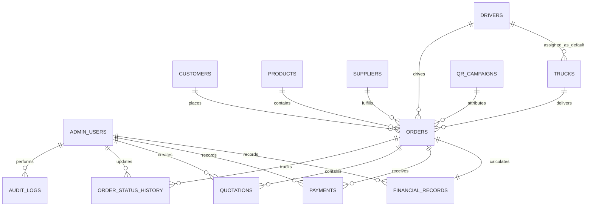

# Database Architecture & Entity Specifications

**Product:** Digital Building-Material Marketplace & Delivery Platform — Nagpur | MVP  
**Database Engine:** Relational SQLite (Node.js built-in `node:sqlite`)  
**Schema File:** `backend/src/db/schema.sql`  
**Migrations:** `backend/src/db/migrate.ts`  
**Seeds:** `backend/src/db/seed.ts`  

> **Database Deployment Note:**  
> SQLite is the authoritative database for the Nagpur MVP. High-concurrency engines such as PostgreSQL are future deployment considerations that will require explicit dialect, sequence, locking, and data-type migration rather than assuming automatic seamless drop-in portability.

---

## 1. Entity-Relationship Model (ERD)



---

## 2. Core Entities & Table Specifications

### 1. `admin_users`
Stores internal operations staff credentials and role assignments.
- `id` (TEXT, PK): Unique identifier (`usr_...`).
- `email` (TEXT, UNIQUE): Staff login email.
- `password_hash` (TEXT): Bcrypt salted password hash (never returned in responses).
- `full_name` (TEXT): Display name.
- `role` (TEXT): Must be `'ADMIN'` or `'SUPER_ADMIN'`.
- `is_active` (INTEGER): Account activation flag (1 or 0).
- `last_login_at` (TEXT): ISO 8601 timestamp of last login.
- `created_at`, `updated_at` (TEXT): Timestamps.

### 2. `products`
The 4 authoritative MVP materials.
- `id` (TEXT, PK): Unique product ID.
- `name` (TEXT): Product name (`Sand`, `Bricks`, `Black Stone / Aggregate`, `Murum`).
- `slug` (TEXT, UNIQUE): URL slug (`sand`, `bricks`, `black-stone-aggregate`, `murum`).
- `category` (TEXT): Domain categorization.
- `description` (TEXT): Detailed plain-language description.
- `unit` (TEXT): Primary billing unit (`Brass`, `Pieces`).
- `min_quantity` (REAL): Minimum deliverable threshold.
- `is_active` (INTEGER): Catalog visibility.
- `typical_use_cases`, `quality_specifications`, `availability_disclaimer` (TEXT): Domain notes.
- `display_order` (INTEGER): Catalog sort priority.

### 3. `customers`
Customer records created upon quote request submission.
- `id` (TEXT, PK): Unique customer identifier.
- `full_name` (TEXT): Contractor or site supervisor name.
- `mobile_number` (TEXT): 10-digit Indian mobile number.
- `whatsapp_number` (TEXT): WhatsApp contact.
- `delivery_address` (TEXT): Street address or construction site landmark.
- `area_pincode` (TEXT): Nagpur postal area or pincode.
- `map_pin_url` (TEXT): Optional Google Maps pin link.
- `internal_notes` (TEXT): Operational notes.

### 4. `qr_campaigns`
Tracking offline marketing panels on partner trucks.
- `campaign_code` (TEXT, UNIQUE): QR slug (e.g. `TRUCK_01`).
- `truck_identifier` (TEXT): Associated vehicle.
- `scan_count` (INTEGER): Number of times QR was scanned.

### 5. `suppliers`
Asset-light registry of verified quarries and manufacturers.
- `business_name`, `contact_person`, `mobile_number`, `location_address`.
- `supported_materials` (TEXT): JSON array of materials.
- `verification_status` (TEXT): `VERIFIED`, `PENDING`, `REJECTED`.
- `indicative_purchase_price` (REAL): Recent cost benchmark.
- `price_updated_at` (TEXT): Timestamp of last rate verification.

### 6. `drivers`
Asset-light driver partner registry (decoupled from trucks).
- `id` (TEXT, PK): Unique driver ID.
- `full_name` (TEXT): Driver's full name.
- `mobile_number` (TEXT): Driver's phone number.
- `license_number` (TEXT): Commercial driving license number.
- `verification_status` (TEXT): `VERIFIED`, `PENDING`, `REJECTED`.
- `availability_status` (TEXT): `Available`, `Busy`, `Offline`.
- `notes` (TEXT): Verification or operational notes.
- `is_active` (INTEGER): Active status flag.
- `created_at`, `updated_at` (TEXT): Timestamps.

### 7. `trucks`
Partner vehicle registry.
- `id` (TEXT, PK): Unique vehicle ID.
- `registration_number` (TEXT, UNIQUE): Vehicle registration (e.g. `MH-31-...`).
- `capacity_tons` (REAL): Load capacity in metric tons.
- `supported_materials` (TEXT): JSON array of supported materials.
- `owner_name`, `owner_mobile` (TEXT): Owner contacts.
- `default_driver_id` (TEXT, FK -> `drivers.id`, NULLABLE): Default assigned driver.
- `availability_status` (TEXT): `Available`, `Busy`, `Offline`.
- `indicative_transport_rate` (REAL): Per km or per trip benchmark.
- `verification_status` (TEXT): `VERIFIED`, `PENDING`, `REJECTED`.
- `notes`, `is_active`, `created_at`, `updated_at`.

### 8. `orders`
The central transaction entity supporting the 11-stage delivery lifecycle.
- `id` (TEXT, PK): Internal order identifier.
- `order_reference` (TEXT, UNIQUE): Human-readable reference (`NGP-YYMMDD-XXXX`).
- `customer_id` (TEXT, FK -> `customers.id`).
- `product_id` (TEXT, FK -> `products.id`).
- `quantity` (REAL): Requested quantity.
- `unit` (TEXT): Billing unit.
- `delivery_address` (TEXT): Site location snapshot.
- `area_pincode` (TEXT): Nagpur area.
- `preferred_delivery_date` (TEXT): Required date.
- `status` (TEXT): Check constraint enforcing PRD lifecycle:
  `NEW`, `CONTACTED`, `QUOTATION_SENT`, `CONFIRMED`, `SUPPLIER_ASSIGNED`, `TRUCK_ASSIGNED`, `LOADING`, `OUT_FOR_DELIVERY`, `DELIVERED`, `COMPLETED`, `CANCELLED`.
- `cancellation_reason` (TEXT): Mandatory if status is `CANCELLED`.
- `supplier_id` (TEXT, FK -> `suppliers.id`, NULL in early stages).
- `truck_id` (TEXT, FK -> `trucks.id`, NULL in early stages).
- `driver_id` (TEXT, FK -> `drivers.id`, NULL in early stages): Assigned driver for fulfillment.
- `qr_campaign_id` (TEXT, FK -> `qr_campaigns.id`, attribution).

### 9. `order_status_history`
Audit trail of every order state transition.
- `id` (TEXT, PK).
- `order_id` (TEXT, FK -> `orders.id`).
- `previous_status` (TEXT): Prior state.
- `new_status` (TEXT): New state.
- `changed_by_user_id` (TEXT, FK -> `admin_users.id`).
- `notes` (TEXT): Reason or operational context.
- `created_at` (TEXT): Timestamp.

### 10. `quotations`
Snapshot quotation model freezing prices per order.
- `id` (TEXT, PK).
- `quotation_reference` (TEXT, UNIQUE): Quotation identifier.
- `order_id` (TEXT, FK -> `orders.id`).
- `material_cost` (REAL): Base supplier cost.
- `transport_cost` (REAL): Freight cost to site.
- `loading_cost` (REAL): Quarry loading charges.
- `platform_fee` (REAL): Marketplace coordination fee.
- `discount` (REAL): Commercial concessions.
- `final_delivered_price` (REAL): Total customer price.
- `estimated_gross_margin` (REAL): Expected profit margin.
- `validity_date` (TEXT): Price expiry date.
- `created_by_user_id` (TEXT, FK -> `admin_users.id`).

### 11. `payments`
Recording offline and digital payments.
- `order_id`, `amount`, `payment_method` (Cash, UPI, Bank Transfer, Cheque).
- `payment_status` (TEXT): `Pending`, `Partially Paid`, `Paid`, `Refunded`.
- `transaction_reference` (TEXT), `payment_date` (TEXT).

### 12. `financial_records`
Order-level unit economics.
- `order_id` (TEXT, UNIQUE, FK -> `orders.id`).
- `actual_revenue`, `actual_material_cost`, `actual_transport_cost`, `other_direct_costs`.
- `actual_gross_margin` (REAL): `actual_revenue - (actual_material_cost + actual_transport_cost + other_direct_costs)`.

### 13. `audit_logs`
System-wide security and operations audit log.
- `user_id` (TEXT, FK -> `admin_users.id`, nullable for public actions).
- `action` (TEXT): Event description.
- `entity_type` (TEXT): `ORDER`, `QUOTATION`, `SUPPLIER`, etc.
- `entity_id` (TEXT): Target ID.
- `changes_json` (TEXT): JSON before/after diff.
- `ip_address` (TEXT): Client IP.

---

## 3. Performance Indexes

```sql
CREATE INDEX idx_orders_status ON orders(status);
CREATE INDEX idx_orders_customer ON orders(customer_id);
CREATE INDEX idx_orders_product ON orders(product_id);
CREATE INDEX idx_orders_truck ON orders(truck_id);
CREATE INDEX idx_orders_driver ON orders(driver_id);
CREATE INDEX idx_orders_created_at ON orders(created_at);
CREATE INDEX idx_customers_mobile ON customers(mobile_number);
CREATE INDEX idx_drivers_mobile ON drivers(mobile_number);
CREATE INDEX idx_trucks_default_driver ON trucks(default_driver_id);
CREATE INDEX idx_order_status_history_order ON order_status_history(order_id);
CREATE INDEX idx_quotations_order ON quotations(order_id);
CREATE INDEX idx_payments_order ON payments(order_id);
CREATE INDEX idx_audit_logs_entity ON audit_logs(entity_type, entity_id);
```
